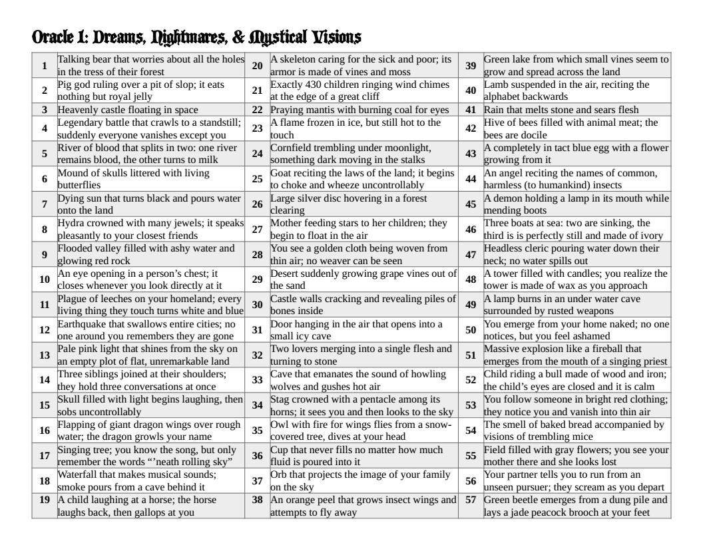
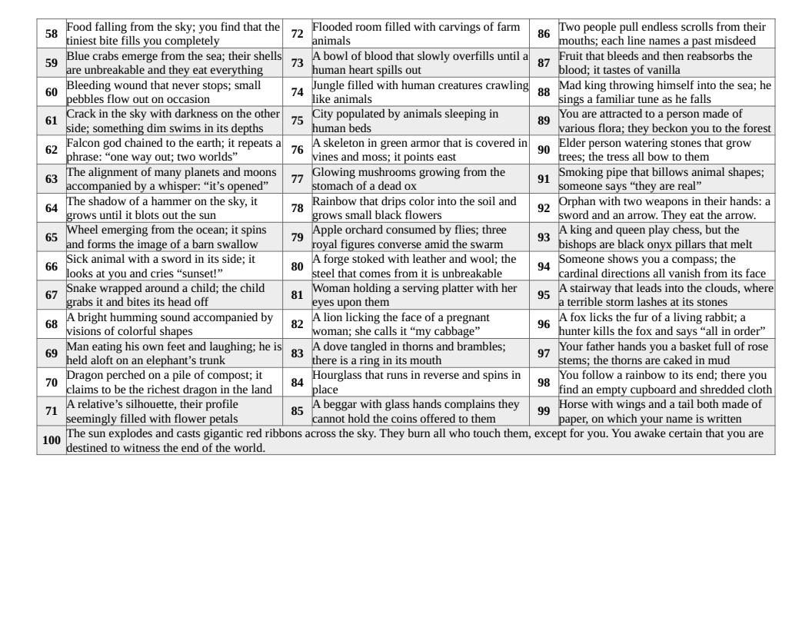

The game I'm running now features a cleric whose primary strength is the connection he has accidentally established with his god. This god, however, will only speak to him through mystical visions, dreams, and especially nightmares. It's a blessing and a curse for him, and a helpful way for me to keep the story moving in unpredictable directions. Intrepreting images and dream content is a lot of fun on its own, but it's also a useful mechanic for playing solo RPGS. 

Up to this point, whenever my Cleric has had a vision, I have simply gone with the first two or three images that have come to my mind. For example, if the oracle system I am using tells me that the cleric is going to have a visionary dream, I will force myself to spit out three nouns as quickly as possible, with as little thinking as I can manage. In last night's session, that was "waterfall, horse, rope."

Then, I force myself to find a noun, again as quickly as possible. Last night, it was "eating" (I was hungry).

How do I put them together? It all depends on the context of the story, but that's really no different than rolling dice and using an oracle to get nouns and verbs for a random event. In my campaign, the Cleric discovered from locals that there is a large ranch near a local waterfall, which makes sense of the first two images. I had to roll a bit more to make sense of rope, but this congealed into a revelation that the stablemaster was once a prisoner. The "eating" part was easy. In my game, people are being poisoned by tainted medicine. The culprit is still up in the air. Perhaps this is my first lead?

But sometimes I am tired and can't come up with fresh images very easily, or I keep repeating images from within a network of related ideas: ball, orb, sphere, planet, moon, etc. To help me along, I got a little ambitious and decided to draft my first ever d100 table, which I offer below.

The idea here is to roll 1d100 once or twice and use the resulting images as inspiration for a mystical vision, dream, or nightmare. If they contradict each other, all the better: dreams don't always make sense, but contradictions make for interesting sources of tension and mystery.

Of course, you should feel free to hack this and use it in whatever way you find interesting. There's a decent amount of random imagery here, so I can imagine it being used in a variety of ways. 

Happy questing!

- [Download: d100 table of mystical visions, dreams, and nightmares (PDF)](Oracle_1_dreams_visions.pdf)

- [Download: d100 table of mystical visions, dreams, and nightmares (ODT) ](Oracle_1_dreams_visions.odt)

